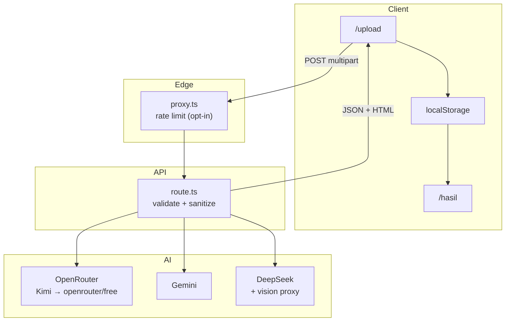

# VisAI — UI Design Analyzer

Upload a UI screenshot or mockup and get structured design analysis plus **HTML + Tailwind** you can preview and copy — powered by multimodal AI (OpenRouter, Google Gemini, or DeepSeek).

The application lives in **`frontend/`**. Clone this repository, then run all npm commands from that directory.

| | |
|---|---|
| **Stack** | Next.js 16 (App Router), React 19, Tailwind CSS 4, TypeScript |
| **AI providers** | OpenRouter (default), Gemini, DeepSeek — with automatic 429 fallback |
| **Node** | 20+ (see `frontend/package.json` → `engines`) |
| **Locale** | Indonesian UI (`lang="id"`) |

---

## Table of contents

- [What VisAI does](#what-visai-does)
- [Prerequisites](#prerequisites)
- [Get the source code](#get-the-source-code)
- [Installation (local development)](#installation-local-development)
- [Verify your setup](#verify-your-setup)
- [Using the app](#using-the-app)
- [Features](#features)
- [How it works](#how-it-works)
- [AI providers & configuration](#ai-providers--configuration)
- [API reference](#api-reference)
- [Project structure](#project-structure)
- [Scripts](#scripts)
- [Environment variables](#environment-variables)
- [Security](#security)
- [Privacy & data handling](#privacy--data-handling)
- [Testing](#testing)
- [Deployment (Vercel)](#deployment-vercel)
- [Pre-launch checklist](#pre-launch-checklist)
- [Troubleshooting](#troubleshooting)
- [Contributing / development](#contributing--development)
- [Tech dependencies](#tech-dependencies)

---

## What VisAI does

1. **Upload** a PNG, JPEG, or WebP screenshot (max 4 MB).
2. **Analyze** the image with a vision-capable AI model.
3. **Receive** a JSON analysis (layout, components, colors, typography) and generated HTML with Tailwind classes.
4. **Preview** the HTML in a sandboxed iframe and **copy** the code to your clipboard.

Results are stored in the browser (`localStorage`) — no server-side database. Screenshots are processed in memory per request and sent to third-party AI APIs.

---

## Prerequisites

Install these **before** cloning:

| Tool | Version | Notes |
|------|---------|--------|
| [Git](https://git-scm.com/downloads) | Any recent | Clone and pull updates |
| [Node.js](https://nodejs.org/) | **20 or newer** | Check with `node -v` |
| npm | Comes with Node | Check with `npm -v` |

You need **at least one AI provider API key**:

| Provider | Get a key | Vision support |
|----------|-----------|----------------|
| **OpenRouter** (recommended) | [openrouter.ai/keys](https://openrouter.ai/keys) | Yes — Kimi free model works without credits |
| **Google Gemini** | [aistudio.google.com/apikey](https://aistudio.google.com/apikey) | Yes |
| **DeepSeek** | [platform.deepseek.com/api_keys](https://platform.deepseek.com/api_keys) | Text-only — uses Gemini/OpenRouter as vision proxy |

Optional for full local testing:

- **Playwright browsers** — installed automatically when you run `npm run test:e2e` (first run downloads Chromium).

---

## Get the source code

### Clone the repository

```bash
git clone https://github.com/Rainzy21/AI-Uas-Project.git
cd AI-Uas-Project
```

### Repository layout

```
AI-Uas-Project/              ← Git repository root (this README)
├── README.md
└── frontend/                ← VisAI app (all npm commands run here)
    ├── app/                   # Pages + API routes
    ├── components/            # React UI
    ├── lib/                   # Shared logic (AI, security, validation)
    ├── e2e/                   # Playwright tests
    ├── proxy.ts               # Edge rate limit on /api/analyze
    ├── package.json
    ├── .env.example           # Env template (committed)
```

### Work in the frontend folder

All install, dev, build, and test commands must be run from `frontend/`:

```bash
cd frontend
```

### Update to the latest code

```bash
cd AI-Uas-Project
git pull origin main
cd frontend
npm install    # install any new dependencies
```

### If you do not use Git

Download the repository as a ZIP from GitHub (**Code → Download ZIP**), extract it, then:

```bash
cd path/to/AI-Uas-Project/frontend
```

---

## Installation (local development)

Follow these steps in order the first time you set up the project.

### Step 1 — Go to the frontend directory

```bash
cd AI-Uas-Project/frontend
```

(Adjust the path if you cloned or extracted the repo elsewhere.)

### Step 2 — Install dependencies

```bash
npm install
```

This reads `package.json` and `package-lock.json` and installs Next.js, AI SDKs, and other packages into `node_modules/` (ignored by Git).

### Step 3 — Create your local environment file

```bash
cp .env.example .env.local
```

- **`.env.example`** — Template committed to Git (safe to share).
- **`.env.local`** — Your private config (API keys). **Never commit this file.**

### Step 4 — Add your API key(s)

Open `.env.local` in a text editor.

**Minimum setup (OpenRouter only):**

```bash
OPENROUTER_API_KEY=sk-or-v1-your-key-here
OPENROUTER_MODEL=moonshotai/kimi-k2.6:free
ANALYZE_PROVIDER=openrouter
NEXT_PUBLIC_APP_URL=http://localhost:3000
```

**Recommended for testing (all three providers + auto-fallback on rate limits):**

```bash
ANALYZE_PROVIDER=openrouter
OPENROUTER_API_KEY=sk-or-v1-your-key-here
OPENROUTER_MODEL=moonshotai/kimi-k2.6:free

GEMINI_API_KEY=your-gemini-key
GEMINI_MODEL=gemini-2.5-flash

DEEPSEEK_API_KEY=sk-your-deepseek-key
DEEPSEEK_MODEL=deepseek-chat

NEXT_PUBLIC_APP_URL=http://localhost:3000
RATE_LIMIT_ENABLED=false
```

See [Environment variables](#environment-variables) and [AI providers & configuration](#ai-providers--configuration) for the full list.

### Step 5 — Start the development server

```bash
npm run dev
```

When ready, you should see something like:

```text
▲ Next.js …
- Local: http://localhost:3000
```

Open [http://localhost:3000](http://localhost:3000) in your browser.

> **Note:** After changing `.env.local`, stop the dev server (`Ctrl+C`) and run `npm run dev` again so Next.js reloads environment variables.

---

## Verify your setup

Run these from `frontend/` to confirm everything works.

### 1. Lint

```bash
npm run lint
```

Expected: no ESLint errors.

### 2. Unit tests

```bash
npm test
```

Expected: all tests pass (Vitest — API route, `lib/`, health endpoint).

### 3. Production build (optional)

```bash
npm run build
```

Expected: completes without TypeScript or build errors.

### 4. Manual smoke test

1. Open [http://localhost:3000/upload](http://localhost:3000/upload).
2. Upload a PNG/JPG/WebP screenshot (under 4 MB).
3. Click **Proses Gambar** and wait for analysis (free models may take 30–90 seconds).
4. You should land on `/hasil` with analysis cards and a **Preview** tab.
5. Switch to **Kode HTML**, click **Salin**, and confirm copy works.

### 5. Health check (optional)

```bash
curl http://localhost:3000/api/health
```

Expected: `{"status":"ok","timestamp":"..."}`

### 6. E2E tests (optional)

```bash
npm run test:e2e
```

First run builds the app and may take a few minutes. Playwright starts the app on port **3456** automatically.

---

## Using the app

| Page | URL | Purpose |
|------|-----|---------|
| Home | `/` | Landing page |
| How it works | `/cara-kerja` | Pipeline overview |
| Upload | `/upload` | Upload image and run analysis |
| Results | `/hasil` | Preview HTML and copy code (uses `localStorage`) |
| Privacy | `/kebijakan-privasi` | AI data disclosure and privacy notice |

**Typical flow:** Beranda → Upload → Hasil.

Results are stored in the browser as `visai_result` in **localStorage**. Clearing site data or using **Upload Baru** removes them. Results do not sync across devices or browsers.

---

## Features

### Upload & validation

- **Formats:** PNG, JPEG, WebP — max **4 MB** (aligned with Vercel serverless body limits)
- **Client validation:** MIME type + magic-byte sniffing before upload
- **Server validation:** MIME whitelist, size cap, magic-byte verification, declared-vs-detected MIME mismatch rejection

### AI analysis

- **Structured JSON output:** Title, layout, components, color palette, typography, style (Zod-validated)
- **HTML generation:** Tailwind utility classes on every element
- **Multi-provider:** OpenRouter, Gemini, DeepSeek — select via `ANALYZE_PROVIDER`
- **429 fallback:** When the primary provider is rate-limited, automatically tries other configured providers (unless `ANALYZE_FALLBACK=false`)
- **OpenRouter model chain:** Kimi free → `openrouter/free` on upstream 429/502/503
- **Retries:** Up to 4 attempts on transient errors per provider

### Preview & output

- **DOMPurify sanitization** with strict allowlist (no `script`, `iframe`, event handlers)
- **Tailwind CDN injection** server-side for styled preview
- **Sandboxed iframe** (`sandbox="allow-scripts"`) on `/hasil`
- **Copy to clipboard** with success/error feedback
- **HTML size cap:** 400 KB in Zod schema

### Security & operations

- **Optional API secret:** `ANALYZE_API_SECRET` + `x-visai-key` header
- **Per-IP rate limiting:** Opt-in via `RATE_LIMIT_ENABLED=true` (off by default for testing)
- **Distributed rate limits:** Upstash Redis support for serverless multi-instance deploys
- **Security headers:** `X-Content-Type-Options`, `Referrer-Policy`, `X-Frame-Options`, `Permissions-Policy`, CSP (report-only)
- **Structured logging** with `requestId` for tracing
- **Optional Sentry** and OpenTelemetry integration

### Accessibility

- Skip-to-content link
- `aria-label` on navigation and icon buttons
- `role="alert"` on error messages
- Tab pattern (`role="tablist"`, `aria-selected`) on Preview/Code tabs
- Loading state announced to screen readers

---

## How it works



### Pipeline steps

1. User uploads an image on `/upload`.
2. `proxy.ts` applies per-IP rate limiting **only when** `RATE_LIMIT_ENABLED=true`.
3. `app/api/analyze/route.ts`:
   - Validates auth (`x-visai-key` if secret is set)
   - Validates file type, size, and magic bytes
   - Calls the configured AI provider via `callAnalyzeWithFallback`
   - Extracts JSON from the model response (`extractJson`)
   - Validates with Zod (`VisAIResultSchema`)
   - Sanitizes HTML (DOMPurify) and injects Tailwind CDN (`preparePreviewHtml`)
4. Client stores the result in `localStorage` and navigates to `/hasil`.
5. `/hasil` renders analysis cards, sandboxed preview, and copyable code.

### DeepSeek vision proxy

DeepSeek's API is text-only. When `ANALYZE_PROVIDER=deepseek`, the app first describes the image using Gemini or OpenRouter (whichever key is available), then sends that description to DeepSeek for HTML generation. If neither vision key is set, the API returns a 500 with a clear error message.

---

## AI providers & configuration

### Provider selection

Set `ANALYZE_PROVIDER` to one of: `openrouter`, `gemini`, `deepseek`.

If unset, the app picks the first available key in order: DeepSeek → Gemini → OpenRouter.

### OpenRouter (default)

```bash
ANALYZE_PROVIDER=openrouter
OPENROUTER_API_KEY=sk-or-v1-...
OPENROUTER_MODEL=moonshotai/kimi-k2.6:free
```

- **Free model:** `moonshotai/kimi-k2.6:free` — no credits needed, but can be slow or rate-limited
- **Model chain:** On 429/502/503, retries with `openrouter/free` automatically
- **Paid models:** Add credits at [openrouter.ai/credits](https://openrouter.ai/credits), then e.g. `OPENROUTER_MODEL=qwen/qwen3.7-plus`

### Google Gemini

```bash
ANALYZE_PROVIDER=gemini
GEMINI_API_KEY=...
GEMINI_MODEL=gemini-2.5-flash
```

Free tier available. Also used as vision proxy for DeepSeek.

### DeepSeek

```bash
ANALYZE_PROVIDER=deepseek
DEEPSEEK_API_KEY=sk-...
DEEPSEEK_MODEL=deepseek-chat

# Required for image reading (at least one):
GEMINI_API_KEY=...
# or
OPENROUTER_API_KEY=...
```

### Cross-provider fallback

When the primary provider returns **429 (rate limit)**, the app automatically tries other configured providers. Disable with:

```bash
ANALYZE_FALLBACK=false
```

Fallback does **not** trigger on 502/503 from non-OpenRouter providers — only OpenRouter has internal model-chain retries for those codes.

### Model & timeout tips

| Scenario | Recommendation |
|----------|----------------|
| Testing locally | Keep `RATE_LIMIT_ENABLED=false`; defaults are 90s server / 120s client timeout |
| Free models slow | Wait 30–90s; or set faster paid models |
| Timeouts | Override `OPENROUTER_TIMEOUT_MS` and `NEXT_PUBLIC_ANALYZE_TIMEOUT_MS` in `.env.local` |
| Stale preview | Re-upload after model changes; old `localStorage` keeps previous HTML |

---

## API reference

### `POST /api/analyze`

Analyzes an uploaded UI screenshot.

**Request:**

- `Content-Type: multipart/form-data`
- Field: `image` (file) — PNG, JPEG, or WebP, max 4 MB
- Optional header: `x-visai-key` (required when `ANALYZE_API_SECRET` is set)

**Success response (200):**

```json
{
  "analysis": {
    "title": "Login Page",
    "layout": "Centered card on dark background...",
    "components": [
      { "name": "Email input", "description": "...", "position": "top of form" }
    ],
    "colorPalette": ["#0f0f0f", "#ffffff", "#333333"],
    "typography": {
      "headings": "Inter, bold",
      "body": "Inter, regular",
      "style": "16px body, 24px headings"
    },
    "style": "Dark minimal login"
  },
  "html": "<!DOCTYPE html>...",
  "timestamp": 1717862400000
}
```

**Error responses:**

| Status | Meaning |
|--------|---------|
| 400 | Missing image, invalid type, size exceeded, MIME mismatch |
| 401 | Missing or wrong `x-visai-key` (when secret is enabled) |
| 429 | Per-IP rate limit exceeded (when `RATE_LIMIT_ENABLED=true`) |
| 500 | API key not configured, vision proxy unavailable |
| 502 | Provider error, JSON parse failure, schema validation failure |
| 504 | Request timed out |

All error responses include `{ "error": "...", "requestId": "..." }` where applicable.

### `GET /api/health`

Uptime monitoring endpoint.

**Response (200):**

```json
{
  "status": "ok",
  "timestamp": "2026-06-08T12:00:00.000Z"
}
```

---

## Project structure

```
frontend/
├── app/
│   ├── api/
│   │   ├── analyze/route.ts       # Main analysis endpoint
│   │   └── health/route.ts        # Health check
│   ├── upload/page.tsx            # Upload page
│   ├── hasil/page.tsx             # Results page
│   ├── cara-kerja/page.tsx        # How it works
│   ├── kebijakan-privasi/page.tsx # Privacy & AI data notice
│   ├── layout.tsx                 # Root layout (nav, footer, skip link)
│   ├── page.tsx                   # Home
│   └── globals.css
├── components/
│   ├── UploadSection.tsx          # Upload UI + API call
│   ├── ResultSection.tsx          # Analysis cards, preview, code tabs
│   ├── Navbar.tsx
│   ├── HeroSection.tsx
│   └── PipelineSection.tsx
├── lib/
│   ├── analyzeConfig.ts           # Provider resolution
│   ├── analyzeSchema.ts           # Zod schemas
│   ├── analyzePrompts.ts          # System + user prompts
│   ├── analyzeTimeouts.ts         # Server/client timeout defaults
│   ├── analyzeAuth.ts             # Optional API secret check
│   ├── callAnalyzeWithFallback.ts # Multi-provider + 429 fallback
│   ├── callOpenRouter.ts          # OpenRouter SDK + model chain
│   ├── callGemini.ts              # Gemini API
│   ├── callDeepSeek.ts            # DeepSeek API
│   ├── describeImageForDeepSeek.ts# Vision proxy for DeepSeek
│   ├── openRouterModels.ts        # Kimi → openrouter/free chain
│   ├── extractJson.ts             # JSON extraction from fenced responses
│   ├── sanitizeHtml.ts            # DOMPurify allowlist
│   ├── preparePreviewHtml.ts      # Tailwind CDN injection
│   ├── formatHtml.ts              # HTML formatting
│   ├── sniffImageFile.ts          # Client-side image validation
│   ├── detectMimeType.ts          # Server-side magic-byte detection
│   ├── safeColor.ts               # CSS color sanitization
│   ├── rateLimit.ts               # In-memory + Upstash rate limiting
│   ├── rateLimitEnabled.ts        # Opt-in rate limit toggle
│   ├── observability.ts           # Sentry integration
│   └── imageConstants.ts          # MAX_SIZE, ALLOWED_TYPES
├── proxy.ts                       # Edge middleware — rate limit on /api/analyze
├── e2e/                           # Playwright specs
├── instrumentation.ts             # Sentry + optional OTel
├── sentry.*.config.ts             # Sentry (optional)
├── next.config.ts                 # Security headers + CSP report-only
├── playwright.config.ts
├── .env.example
├── .gitignore
└── package.json
```

---

## Scripts

Run from `frontend/`:

| Command | Description |
|---------|-------------|
| `npm run dev` | Development server (rate limit **off** by default) |
| `npm run build` | Production build |
| `npm start` | Run production build locally |
| `npm run lint` | ESLint (also runs in CI) |
| `npm test` | Vitest — API route + `lib/` unit tests |
| `npm run test:watch` | Vitest watch mode |
| `npm run test:coverage` | Coverage report (`lib/` + `app/api/`) |
| `npm run test:e2e` | Playwright (builds app on port **3456**) |
| `npm run test:e2e:ui` | Playwright UI mode |

---

## Environment variables

Copy from [`frontend/.env.example`](frontend/.env.example). **Never commit** `frontend/.env.local` or real API keys.

### AI providers

| Variable | Default | Description |
|----------|---------|-------------|
| `ANALYZE_PROVIDER` | Auto-detect from keys | `openrouter`, `gemini`, or `deepseek` |
| `OPENROUTER_API_KEY` | — | OpenRouter API key (server-only) |
| `OPENROUTER_MODEL` | `moonshotai/kimi-k2.6:free` | [Vision-capable model](https://openrouter.ai/models) |
| `GEMINI_API_KEY` | — | Google Gemini key (server-only) |
| `GEMINI_MODEL` | `gemini-2.5-flash` | Gemini model ID |
| `DEEPSEEK_API_KEY` | — | DeepSeek key (server-only) |
| `DEEPSEEK_MODEL` | `deepseek-chat` | DeepSeek model ID |
| `ANALYZE_FALLBACK` | enabled | Set `false` to disable cross-provider 429 fallback |
| `NEXT_PUBLIC_APP_URL` | `http://localhost:3000` | HTTP referer sent to OpenRouter |

### Timeouts

| Variable | Default | Description |
|----------|---------|-------------|
| `OPENROUTER_TIMEOUT_MS` | `90000` | Server timeout for AI requests (all providers) |
| `NEXT_PUBLIC_ANALYZE_TIMEOUT_MS` | `120000` | Browser `fetch` abort time (should exceed server timeout) |

### Security / API access

| Variable | Description |
|----------|-------------|
| `ANALYZE_API_SECRET` | If set, requires `x-visai-key` header on `/api/analyze` |
| `NEXT_PUBLIC_ANALYZE_API_SECRET` | Same value for the browser (when secret is enabled) |

> **Note:** `NEXT_PUBLIC_ANALYZE_API_SECRET` is embedded in the client bundle — it deters casual abuse only, not determined attackers. Use together with rate limiting for production.

### Rate limiting (`proxy.ts`)

| Variable | Default | Description |
|----------|---------|-------------|
| `RATE_LIMIT_ENABLED` | `false` (opt-in) | Set `true` to enable per-IP limits on `/api/analyze` |
| `RATE_LIMIT_REQUESTS` | `5` | Max requests per IP per window |
| `RATE_LIMIT_WINDOW_SEC` | `60` | Window length in seconds |
| `UPSTASH_REDIS_REST_URL` | — | Upstash Redis URL (recommended for production serverless) |
| `UPSTASH_REDIS_REST_TOKEN` | — | Upstash token |

Without Upstash, rate limits use in-memory buckets (per serverless instance).

### Observability (optional)

| Variable | Description |
|----------|-------------|
| `SENTRY_DSN` | Server-side Sentry |
| `NEXT_PUBLIC_SENTRY_DSN` | Client Sentry |
| `OTEL_ENABLED` | `true` to enable `@vercel/otel` |

### E2E only (do not use in production)

| Variable | Description |
|----------|-------------|
| `NEXT_PUBLIC_E2E_TEST` | `1` — Playwright file-upload hook |

---

## Security

| Topic | Implementation |
|-------|----------------|
| API keys | `OPENROUTER_API_KEY`, `GEMINI_API_KEY`, `DEEPSEEK_API_KEY` — server-only (never `NEXT_PUBLIC_`) |
| Upload | MIME whitelist + 4 MB cap + magic-byte sniffing + content/type mismatch rejection |
| HTML output | DOMPurify allowlist; forbids `script`, `iframe`, `object`, `embed`, `base`, event handlers |
| Preview | Sandboxed iframe (`allow-scripts` only); Tailwind CDN injected server-side after sanitization |
| API access | Optional `ANALYZE_API_SECRET` + `x-visai-key` header |
| Rate limiting | Opt-in per-IP limit via `proxy.ts`; Upstash Redis for distributed deploys |
| Headers | `X-Content-Type-Options: nosniff`, `Referrer-Policy`, `X-Frame-Options: DENY`, `Permissions-Policy`, CSP (report-only) |
| Logging | Structured JSON logs with `requestId`; no raw image data in logs |
| Errors | User-facing messages in Indonesian; stack traces not exposed to clients |

---

## Privacy & data handling

- **No server-side storage** — uploaded images are processed in memory per request, not persisted.
- **Client-side results** — analysis output stored in `localStorage` only.
- **Third-party AI** — screenshots are sent to OpenRouter, Gemini, and/or DeepSeek depending on configuration. Screenshots may contain PII visible in the image.
- **No cookies or analytics** — no session tracking or analytics SDKs (Sentry replays disabled).
- **Privacy page** — [`/kebijakan-privasi`](http://localhost:3000/kebijakan-privasi) documents data practices and links from the upload page and footer.

Before public launch with real user data, review the privacy notice and ensure compliance with applicable regulations.

---

## Testing

### CI pipeline

[`.github/workflows/ci.yml`](frontend/.github/workflows/ci.yml) runs on `main` / `master`:

| Job | Steps |
|-----|-------|
| **test-and-build** | `npm ci` → `npm run lint` → `npm test` → `npm run build` |
| **e2e** | `npm ci` → Playwright Chromium → `npm run test:e2e` |

### Unit test coverage

Tests cover:

- `POST /api/analyze` — auth, validation, provider errors, retries, XSS stripping, success paths
- `GET /api/health`
- Security utilities — `sanitizeHtml`, `preparePreviewHtml`, `detectMimeType`, `sniffImageFile`, `extractJson`
- Provider logic — `callAnalyzeWithFallback`, `callDeepSeek`, `openRouterModels`, `describeImageForDeepSeek`
- Rate limiting — in-memory limiter, `rateLimitEnabled` toggle
- Config — `analyzeConfig`, `analyzeTimeouts`

Run coverage report:

```bash
npm run test:coverage
```

### E2E tests

- Upload → hasil flow with mocked API
- Rate-limit 429 behavior (enables `RATE_LIMIT_ENABLED=true` in Playwright config)

---

## Deployment (Vercel)

### 1. Import the repository

- Set **Root Directory** to `frontend`
- Framework preset: Next.js (auto-detected)

### 2. Required environment variables

| Variable | Value |
|----------|-------|
| `OPENROUTER_API_KEY` | Your OpenRouter key |
| `NEXT_PUBLIC_APP_URL` | Production URL (e.g. `https://visai.example.com`) |

### 3. Recommended for production

| Variable | Why |
|----------|-----|
| `ANALYZE_API_SECRET` + `NEXT_PUBLIC_ANALYZE_API_SECRET` | Reduce casual API abuse |
| `RATE_LIMIT_ENABLED=true` | Enable per-IP rate limiting |
| `UPSTASH_REDIS_REST_URL` + `UPSTASH_REDIS_REST_TOKEN` | Distributed rate limits across serverless instances |
| `SENTRY_DSN` + `NEXT_PUBLIC_SENTRY_DSN` | Production error alerting |
| `GEMINI_API_KEY` / `DEEPSEEK_API_KEY` | Provider fallback resilience |

### 4. Build settings

- **Build command:** `npm run build` (default)
- **Install command:** `npm ci` (default)
- **Node.js version:** 20+
- Keep uploads ≤ **4 MB** (Vercel serverless body limit)

### 5. Post-deploy verification

1. `curl https://your-domain/api/health` → `{"status":"ok",...}`
2. Upload a screenshot on `/upload` → confirm `/hasil` preview works
3. If secret is enabled: confirm 401 without `x-visai-key`
4. If rate limit is enabled: confirm 429 after exceeding limit

---

## Pre-launch checklist

Use this before flipping to production:

- [ ] `OPENROUTER_API_KEY` (and/or `GEMINI_API_KEY`, `DEEPSEEK_API_KEY`) set in production env
- [ ] `NEXT_PUBLIC_APP_URL` set to production domain
- [ ] `RATE_LIMIT_ENABLED=true` (when ready — off during testing)
- [ ] `UPSTASH_REDIS_REST_URL` + `UPSTASH_REDIS_REST_TOKEN` configured (for serverless)
- [ ] `ANALYZE_API_SECRET` + `NEXT_PUBLIC_ANALYZE_API_SECRET` configured (recommended)
- [ ] `SENTRY_DSN` + `NEXT_PUBLIC_SENTRY_DSN` configured (recommended)
- [ ] Privacy policy linked in UI (`/kebijakan-privasi`)
- [ ] `npm run lint` and `npm test` pass locally
- [ ] Manual smoke test on production URL (upload → analyze → preview → copy)
- [ ] Verify `/api/health` responds
- [ ] Verify 429 rate limit behavior (when enabled)
- [ ] Verify 401 when secret is enabled and header is missing

---

## Troubleshooting

| Symptom | What to do |
|---------|------------|
| `OPENROUTER_API_KEY is not set` | Create `.env.local` from `.env.example`, add key, restart `npm run dev` |
| `API key not configured` | Set at least one provider key; check `ANALYZE_PROVIDER` matches available keys |
| `command not found: npm` | Install Node.js 20+ |
| `EACCES` / permission errors | Avoid `sudo npm install`; fix npm permissions or use nvm |
| **Terlalu banyak permintaan…** | App rate limit — wait, or set `RATE_LIMIT_ENABLED=false` for testing |
| **OpenRouter rate limit…** | Free model busy — wait, switch model, enable fallback providers, or use paid model |
| **Permintaan habis waktu…** | Model too slow — increase `NEXT_PUBLIC_ANALYZE_TIMEOUT_MS`, or use faster/paid model |
| **DeepSeek … vision proxy** | Set `GEMINI_API_KEY` or `OPENROUTER_API_KEY` for image description step |
| **Preview tanpa styling** | Re-upload (old `localStorage` may lack Tailwind CDN injection) |
| **401 Unauthorized** | `ANALYZE_API_SECRET` set without matching `NEXT_PUBLIC_ANALYZE_API_SECRET` |
| **Belum Ada Hasil** on `/hasil` | No `localStorage` data — run analysis from `/upload` first |
| Port 3000 in use | Stop other process or run `npm run dev -- --port 3001` |

**Clear stored results:** DevTools → Application → Local Storage → delete `visai_result`, or click **Upload Baru** on `/hasil`.

**Provider outage:** Check [OpenRouter status](https://openrouter.ai/), [Google AI status](https://status.cloud.google.com/), or switch `ANALYZE_PROVIDER` to a working key.

---

## Contributing / development

1. Fork / branch from `main`.
2. `cd frontend && npm install && cp .env.example .env.local`
3. Make changes; run `npm run lint` and `npm test`.
4. Do **not** commit `.env.local`, `node_modules/`, `.next/`, or `test-results/`.
5. Open a pull request — CI must pass (lint, unit tests, build, E2E).

**What gets committed:** source under `app/`, `components/`, `lib/`, config files, `.env.example`, lockfile, tests.

**What stays local (see `.gitignore`):** secrets, build output, test artifacts, IDE caches, coverage reports.

**Audit reference:** See [`frontend/PRE_PRODUCTION_AUDIT.md`](frontend/PRE_PRODUCTION_AUDIT.md) for a detailed pre-production review.

---

## Tech dependencies

| Package | Purpose |
|---------|---------|
| [Next.js 16](https://nextjs.org/) | App Router, API routes, edge proxy |
| [React 19](https://react.dev/) | UI |
| [Tailwind CSS 4](https://tailwindcss.com/) | Styling |
| [@openrouter/sdk](https://openrouter.ai/docs) | OpenRouter vision + chat |
| [@google/genai](https://ai.google.dev/) | Gemini API |
| [zod](https://zod.dev) | Runtime validation |
| [isomorphic-dompurify](https://github.com/kkomelin/isomorphic-dompurify) | HTML sanitization |
| [@upstash/ratelimit](https://upstash.com/docs/redis/sdks/ratelimit-ts/overview) | Distributed rate limiting |
| [@sentry/nextjs](https://docs.sentry.io/platforms/javascript/guides/nextjs/) | Error tracking (optional) |
| [@vercel/otel](https://www.npmjs.com/package/@vercel/otel) | OpenTelemetry (optional) |
| [lucide-react](https://lucide.dev/) | Icons |
| [Vitest](https://vitest.dev) | Unit tests |
| [Playwright](https://playwright.dev) | E2E tests |

---

## License

Private project — see repository owner for license terms.
