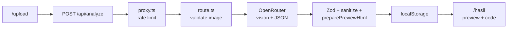

# VisAI — UI Design Analyzer

Upload a UI screenshot or mockup and get structured design analysis plus **HTML + Tailwind** you can preview and copy — powered by [OpenRouter](https://openrouter.ai/) multimodal models.

This README documents the **VisAI frontend** in the `frontend/` directory. Clone the repository, then run all npm commands from `frontend/`.

| | |
|---|---|
| **Stack** | Next.js 16 (App Router), React 19, Tailwind CSS 4, TypeScript |
| **AI** | OpenRouter vision API (`@openrouter/sdk`) |
| **Node** | 20+ (see `package.json` → `engines`) |

---

## Table of contents

- [Prerequisites](#prerequisites)
- [Get the source code](#get-the-source-code)
- [Installation (local development)](#installation-local-development)
- [Verify your setup](#verify-your-setup)
- [Using the app](#using-the-app)
- [Features](#features)
- [How it works](#how-it-works)
- [Project structure](#project-structure)
- [Scripts](#scripts)
- [Environment variables](#environment-variables)
- [OpenRouter & model tips](#openrouter--model-tips)
- [Security](#security)
- [Deployment (Vercel)](#deployment-vercel)
- [Troubleshooting](#troubleshooting)
- [Contributing / development](#contributing--development)

---

## Prerequisites

Install these **before** cloning:

| Tool | Version | Notes |
|------|---------|--------|
| [Git](https://git-scm.com/downloads) | Any recent | Clone and pull updates |
| [Node.js](https://nodejs.org/) | **20 or newer** | Check with `node -v` |
| npm | Comes with Node | Check with `npm -v` |

You also need:

1. **An [OpenRouter](https://openrouter.ai/) account** — to create an API key ([openrouter.ai/keys](https://openrouter.ai/keys)).
2. **Optional:** Credits on OpenRouter if you use paid models ([openrouter.ai/credits](https://openrouter.ai/credits)). The default free model works without credits but can be slow or rate-limited.

Optional for full local testing:

- **Playwright browsers** — installed automatically when you run `npm run test:e2e` (first run downloads Chromium).

---

## Get the source code

### Clone the repository

```bash
git clone https://github.com/Rainzy21/AI-Uas-Project.git
cd AI-Uas-Project
```

### Repository layout

```
AI-Uas-Project/          ← Git repository root
└── frontend/            ← VisAI app (all npm commands run here)
    ├── app/
    ├── components/
    ├── lib/
    ├── e2e/
    ├── package.json
    ├── .env.example     ← Copy to .env.local (not committed)
    └── README.md        ← You are here
```

### Work in the frontend folder

All install, dev, build, and test commands must be run from `frontend/`:

```bash
cd frontend
```

### Update to the latest code

```bash
cd AI-Uas-Project
git pull origin main
cd frontend
npm install    # install any new dependencies
```

### If you do not use Git

Download the repository as a ZIP from GitHub (**Code → Download ZIP**), extract it, then:

```bash
cd path/to/AI-Uas-Project/frontend
```

---

## Installation (local development)

Follow these steps in order the first time you set up the project.

### Step 1 — Go to the frontend directory

```bash
cd AI-Uas-Project/frontend
```

(Adjust the path if you cloned or extracted the repo elsewhere.)

### Step 2 — Install dependencies

```bash
npm install
```

This reads `package.json` and `package-lock.json` and installs Next.js, OpenRouter SDK, and other packages into `node_modules/` (ignored by Git).

### Step 3 — Create your local environment file

```bash
cp .env.example .env.local
```

- **`.env.example`** — Template committed to Git (safe to share).
- **`.env.local`** — Your private config (API keys). **Never commit this file.**

### Step 4 — Add your OpenRouter API key

Open `.env.local` in a text editor and set:

```bash
OPENROUTER_API_KEY=sk-or-v1-your-key-here
```

Get a key at [openrouter.ai/keys](https://openrouter.ai/keys).

Optional but recommended for local dev:

```bash
OPENROUTER_MODEL=moonshotai/kimi-k2.6:free
NEXT_PUBLIC_APP_URL=http://localhost:3000
```

See [Environment variables](#environment-variables) for the full list.

### Step 5 — Start the development server

```bash
npm run dev
```

When ready, you should see something like:

```text
▲ Next.js …
- Local: http://localhost:3000
```

Open [http://localhost:3000](http://localhost:3000) in your browser.

> **Note:** After changing `.env.local`, stop the dev server (`Ctrl+C`) and run `npm run dev` again so Next.js reloads environment variables.

---

## Verify your setup

Run these from `frontend/` to confirm everything works.

### 1. Unit tests

```bash
npm test
```

Expected: all tests pass (Vitest).

### 2. Production build (optional)

```bash
npm run build
```

Expected: completes without TypeScript or build errors.

### 3. Manual smoke test

1. Open [http://localhost:3000/upload](http://localhost:3000/upload).
2. Upload a PNG/JPG/WebP screenshot (under 4 MB).
3. Click **Proses Gambar** and wait for analysis (free models may take 30–90 seconds).
4. You should land on `/hasil` with analysis cards and a **Preview** tab.

### 4. E2E tests (optional)

```bash
npm run test:e2e
```

First run builds the app and may take a few minutes. Playwright starts the app on port **3456** automatically.

---

## Using the app

| Page | URL | Purpose |
|------|-----|---------|
| Home | `/` | Landing |
| How it works | `/cara-kerja` | Pipeline overview |
| Upload | `/upload` | Upload image and run analysis |
| Results | `/hasil` | Preview HTML and copy code (uses `localStorage`) |

**Routes in the UI:** Beranda → Upload → Hasil.

Results are stored in the browser as `visai_result` in **localStorage**. Clearing site data or using **Upload Baru** removes them.

---

## Features

- **Upload** — PNG, JPEG, WebP up to **4 MB** (aligned with Vercel body limits)
- **Validation** — MIME type, magic bytes (client + server), optional API secret
- **Analysis** — Title, layout, components, color palette, typography, style (Zod-validated JSON)
- **HTML output** — Tailwind utility classes; Tailwind CDN injected server-side for preview
- **Preview** — Sandboxed iframe on `/hasil` with copyable formatted code
- **Hardening** — DOMPurify allowlist, per-IP rate limit (production), retries on transient OpenRouter errors
- **Observability** — Structured logs, optional Sentry + OpenTelemetry

---

## How it works



1. User uploads an image on `/upload`.
2. `proxy.ts` applies per-IP rate limiting in production (off in `npm run dev` by default).
3. `app/api/analyze/route.ts` validates the file, calls OpenRouter, parses JSON, sanitizes HTML, and injects Tailwind CDN for preview.
4. The client stores the result in `localStorage` and navigates to `/hasil`.

---

## Project structure

```
frontend/
├── app/
│   ├── api/analyze/route.ts   # OpenRouter integration
│   ├── upload/page.tsx        # Upload page
│   ├── hasil/page.tsx         # Results page
│   ├── cara-kerja/page.tsx    # How it works
│   ├── layout.tsx             # Root layout
│   └── page.tsx               # Home
├── components/                # UI (Upload, Result, Navbar, …)
├── lib/                       # Shared logic (prompts, schema, sanitize, rate limit)
├── proxy.ts                   # Edge rate limit on /api/analyze
├── e2e/                       # Playwright tests
├── instrumentation.ts         # Sentry + optional OTel
├── sentry.*.config.ts         # Sentry (optional)
├── .env.example               # Env template (committed)
├── .gitignore
└── package.json
```

---

## Scripts

Run from `frontend/`:

| Command | Description |
|---------|-------------|
| `npm run dev` | Development server (rate limit **off** by default; longer AI timeouts) |
| `npm run build` | Production build |
| `npm start` | Run production build locally |
| `npm run lint` | ESLint |
| `npm test` | Vitest (API + `lib/`) |
| `npm run test:watch` | Vitest watch mode |
| `npm run test:coverage` | Coverage report |
| `npm run test:e2e` | Playwright (builds app on port **3456**) |
| `npm run test:e2e:ui` | Playwright UI mode |

---

## Environment variables

Copy from [`.env.example`](.env.example). **Never commit** `.env.local` or real API keys.

### Required

| Variable | Where | Description |
|----------|--------|-------------|
| `OPENROUTER_API_KEY` | Server only | OpenRouter API key |

### AI / OpenRouter

| Variable | Default | Description |
|----------|---------|-------------|
| `OPENROUTER_MODEL` | `moonshotai/kimi-k2.6:free` | [Vision-capable model](https://openrouter.ai/models) |
| `OPENROUTER_TIMEOUT_MS` | `90000` (dev) / `30000` (prod) | Server timeout for OpenRouter stream |
| `NEXT_PUBLIC_APP_URL` | `http://localhost:3000` | HTTP referer sent to OpenRouter |

### Security / API access

| Variable | Description |
|----------|-------------|
| `ANALYZE_API_SECRET` | If set, requires `x-visai-key` header on `/api/analyze` |
| `NEXT_PUBLIC_ANALYZE_API_SECRET` | Same value for the browser (when secret is enabled) |

### Rate limiting (`proxy.ts`)

| Variable | Default | Description |
|----------|---------|-------------|
| `RATE_LIMIT_ENABLED` | `true` in production, off in dev unless `true` | Force enable/disable |
| `RATE_LIMIT_REQUESTS` | `5` | Max requests per IP per window |
| `RATE_LIMIT_WINDOW_SEC` | `60` | Window length in seconds |
| `UPSTASH_REDIS_REST_URL` | — | Upstash Redis (recommended for production) |
| `UPSTASH_REDIS_REST_TOKEN` | — | Upstash token |

### Client timeouts

| Variable | Default | Description |
|----------|---------|-------------|
| `NEXT_PUBLIC_ANALYZE_TIMEOUT_MS` | `120000` (dev) / `40000` (prod) | Browser `fetch` abort time |

### Observability (optional)

| Variable | Description |
|----------|-------------|
| `SENTRY_DSN` | Server-side Sentry |
| `NEXT_PUBLIC_SENTRY_DSN` | Client Sentry |
| `OTEL_ENABLED` | `true` to enable `@vercel/otel` |

### E2E only (do not use in production)

| Variable | Description |
|----------|-------------|
| `NEXT_PUBLIC_E2E_TEST` | `1` — Playwright file-upload hook |

---

## OpenRouter & model tips

- **Free models** (`:free`) — No credits, but often slow or rate-limited upstream.
- **Paid models** — Example after adding credits:

  ```bash
  OPENROUTER_MODEL=qwen/qwen3.7-plus
  ```

- Re-upload after changing model; old `localStorage` results keep previous HTML.
- Preview styling: HTML is sanitized, then **Tailwind CDN is injected server-side**.

---

## Security

| Topic | Implementation |
|-------|----------------|
| API keys | `OPENROUTER_API_KEY` server-only (never `NEXT_PUBLIC_`) |
| Upload | MIME + 4 MB + magic-byte validation |
| HTML | DOMPurify; trusted Tailwind script injected after sanitize |
| Production | `ANALYZE_API_SECRET`, rate limit via `proxy.ts`, security headers in `next.config.ts` |

---

## Deployment (Vercel)

1. Import the repo; set **Root Directory** to `frontend`.
2. Set `OPENROUTER_API_KEY`, `NEXT_PUBLIC_APP_URL` (production URL).
3. Recommended: `ANALYZE_API_SECRET`, `NEXT_PUBLIC_ANALYZE_API_SECRET`, Upstash Redis vars.
4. Build: `npm run build` — keep uploads ≤ **4 MB**.

CI: [`.github/workflows/ci.yml`](.github/workflows/ci.yml) runs tests and E2E on `main` / `master`.

---

## Troubleshooting

| Symptom | What to do |
|---------|------------|
| `OPENROUTER_API_KEY is not set` | Create `.env.local` from `.env.example`, add key, restart `npm run dev` |
| `command not found: npm` | Install Node.js 20+ |
| `EACCES` / permission errors | Avoid `sudo npm install`; fix npm permissions or use nvm |
| **Terlalu banyak permintaan…** | App rate limit — wait or disable with dev server (off by default) |
| **OpenRouter rate limit…** | Free model busy — wait, switch model, or use paid model |
| **Permintaan habis waktu…** | Model too slow — wait longer or use faster/paid model |
| **Preview tanpa styling** | Upload again (old `localStorage` missing Tailwind injection) |
| **401 Unauthorized** | `ANALYZE_API_SECRET` set without `NEXT_PUBLIC_ANALYZE_API_SECRET` |
| Port 3000 in use | Stop other process or run `npm run dev -- --port 3001` |

Clear results: DevTools → Application → Local Storage → delete `visai_result`, or **Upload Baru** on `/hasil`.

---

## Contributing / development

1. Fork / branch from `main`.
2. `cd frontend && npm install && cp .env.example .env.local`
3. Make changes; run `npm test` and `npm run lint`.
4. Do **not** commit `.env.local`, `node_modules/`, `.next/`, or `test-results/`.
5. Open a pull request — CI must pass.

**What gets committed:** source under `app/`, `components/`, `lib/`, config files, `.env.example`, lockfile.

**What stays local (see `.gitignore`):** secrets, build output, test artifacts, IDE caches.

---

## Tech dependencies

- [@openrouter/sdk](https://openrouter.ai/docs) — Vision + chat
- [zod](https://zod.dev) — Validation
- [isomorphic-dompurify](https://github.com/kkomelin/isomorphic-dompurify) — HTML sanitization
- [@upstash/ratelimit](https://upstash.com/docs/redis/sdks/ratelimit-ts/overview) — Optional rate limit
- [@sentry/nextjs](https://docs.sentry.io/platforms/javascript/guides/nextjs/) — Optional errors
- [Playwright](https://playwright.dev) / [Vitest](https://vitest.dev) — Tests

---

## License

Private project — see repository root for license terms.
